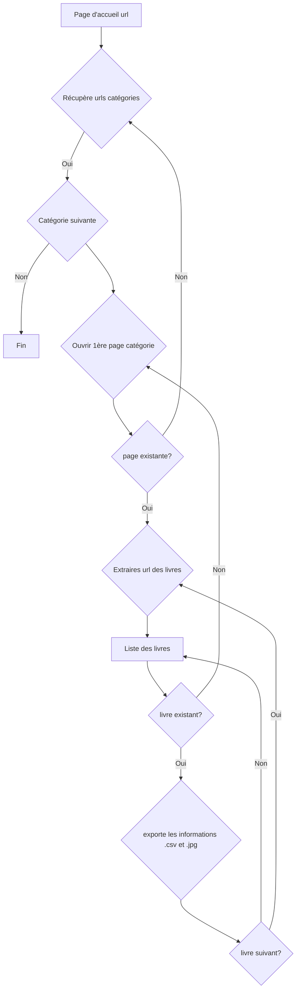

```mermaid
flowchart TD
    A[Page d'accueil url] --> B{Récupère urls catégories}
    B-->|Oui| C{Catégorie suivante}
    C-->|Non| Z[Fin]
    
    C-->D{Ouvrir 1ère page catégorie}
    D --> E{page existante?}
    E-->|Non| B
    
    E-->|Oui| F{Extraires url des livres}
    F-->G[Liste des livres]
    G-->H{livre existant?}
    H-->|Non| D
    
    H-->|Oui| I{exporte les informations .csv et .jpg}
    I-->J{livre suivant?}
    J-->|Non| G
    J-->|Oui| F
    
```

